# Technisch Ontwerp - StudieLog

## Inhoudsopgave
1. [Samenvatting](#samenvatting)
2. [Op te leveren producten](#op-te-leveren-producten)
3. [Definition of Done](#definition-of-done)
4. [Interfaces](#interfaces)
5. [Docentenpaneel](#docentenpaneel)
6. [Ontwikkelomgeving](#ontwikkelomgeving)
7. [Schema's](#schemas)
8. [Activity diagrammen](#activity-diagrammen)
9. [Sequence diagrammen](#sequence-diagrammen)
10. [Database-ontwerp](#database-ontwerp)
11. [Ontwikkeltools](#ontwikkeltools)
12. [Beveiliging](#beveiliging)
13. [Beheer](#beheer)

---

## Samenvatting
StudieLog is een webapplicatie ontwikkeld met Laravel en Inertia React voor het beheren van studiegesprekken tussen studenten en docenten. Het systeem biedt functionaliteiten voor het plannen van afspraken, schrijven van samenvattingen en beheer van klassen en vestigingen.

## Op te leveren producten

### Documentatie
- Projectplan
- Functioneel ontwerp
- Technisch ontwerp
- Testplan

### Softwareproducten
- Laravel project
- MySQL database

## Definition of Done
- Code is getest
- Functionaliteit voldoet aan acceptatiecriteria
- Documentatie is bijgewerkt
- Geen bekende kritieke bugs

## Interfaces

### Login
**Technische specificatie:**
- Laravel Breeze authenticatie
- JWT token management
- Role-based redirect na login
- Remember me functionaliteit

### Account aanmaken
**Technische specificatie:**
- E-mail verificatie flow
- Automatische role assignment
- Account activering required

## Docentenpaneel

### Dashboard overzicht
**Technische specificatie:**
- Real-time overzicht tijdblokken
- Samenvattingen status dashboard
- Klassen en studenten overzicht
- Responsive grid layout

### Tijdblokken beheren
**Technische specificatie:**
- Conflict detection bij aanmaken
- Automatische Outlook integratie

### Samenvattingen beoordelen
**Technische specificatie:**
- Status tracking (pending/approved/rejected)
- Notificatie systeem bij wijzigingen

### Vestigingen en klassen beheren
**Technische specificatie:**
- CRUD operations voor vestigingen
- Student management per klas
- Docent uitnodigingssysteem

## Ontwikkelomgeving
- **Lokale ontwikkeling:** Laravel
- **Database:** MySQL 8.0
- **PHP:** 8.2+
- **Node.js:** 18+
- **Versiebeheer:** Git

## Schema's

### Applicatie Architectuur
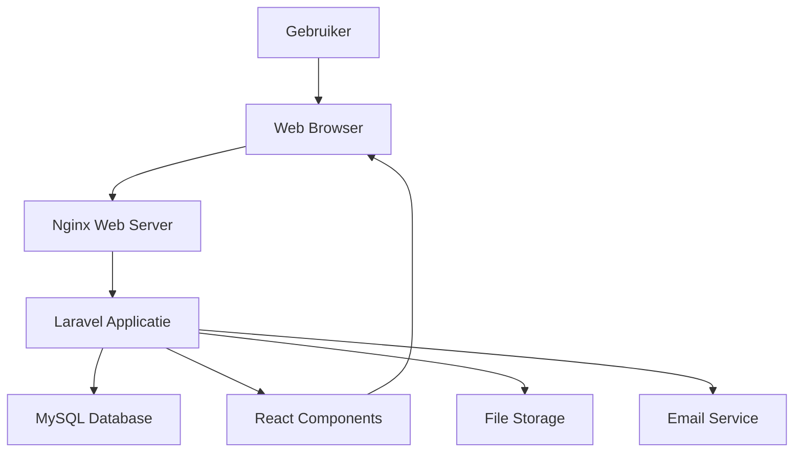

## Activity diagrammen

### Inloggen
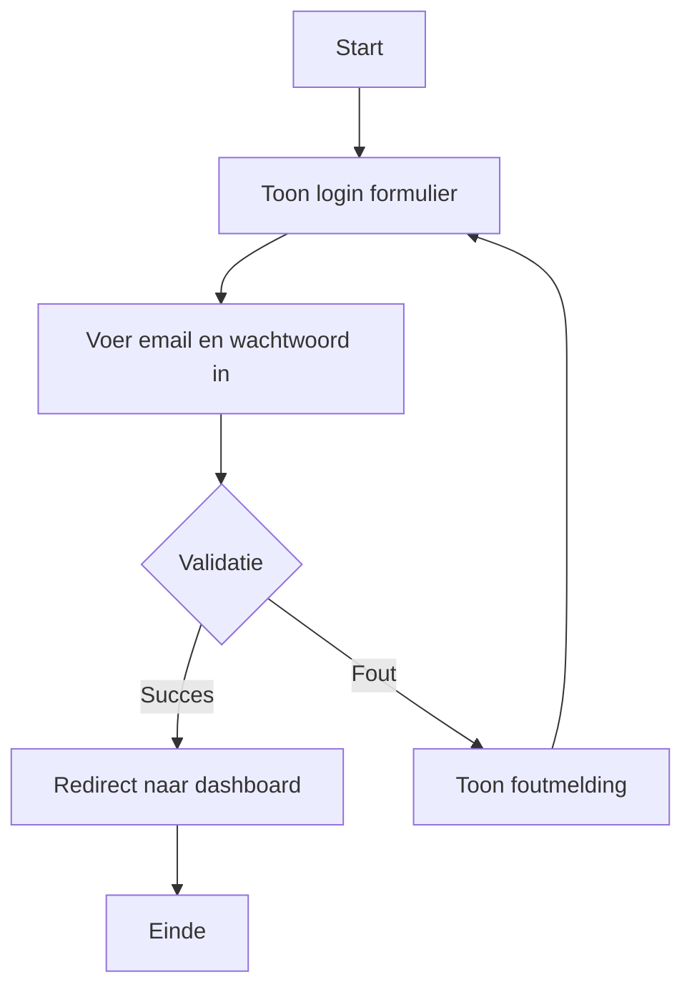

### Account aanmaken voor student
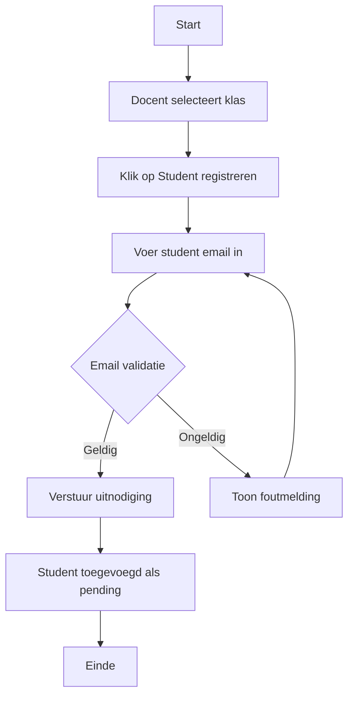

### Vestiging aanmaken
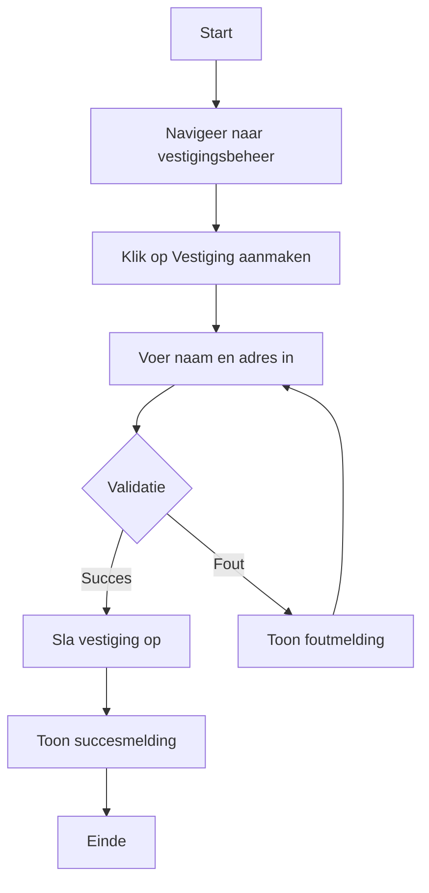

### Klas aanmaken
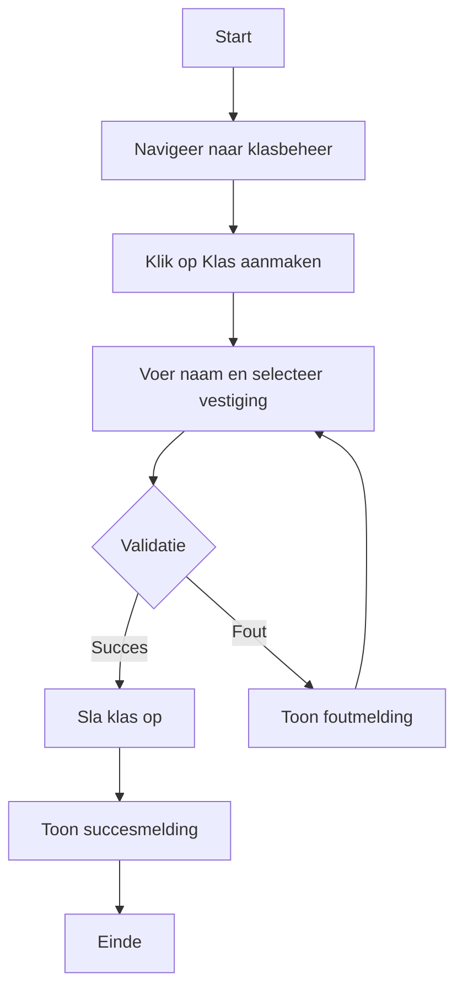

### Tijdblok aanmaken
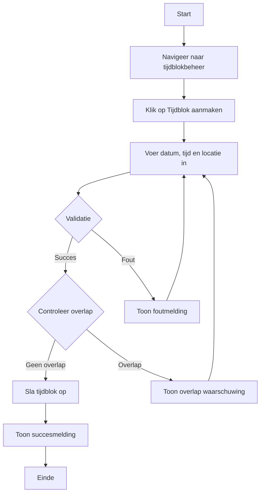

### Tijdblokken reserveren
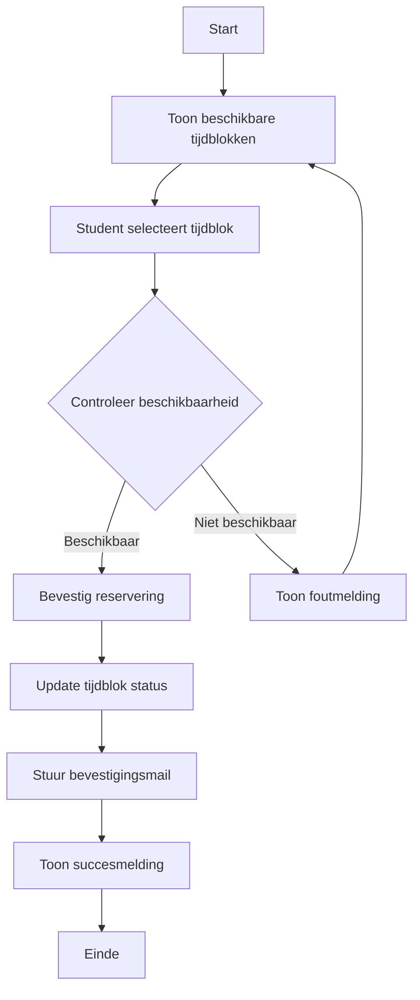

### Verslag aanmaken
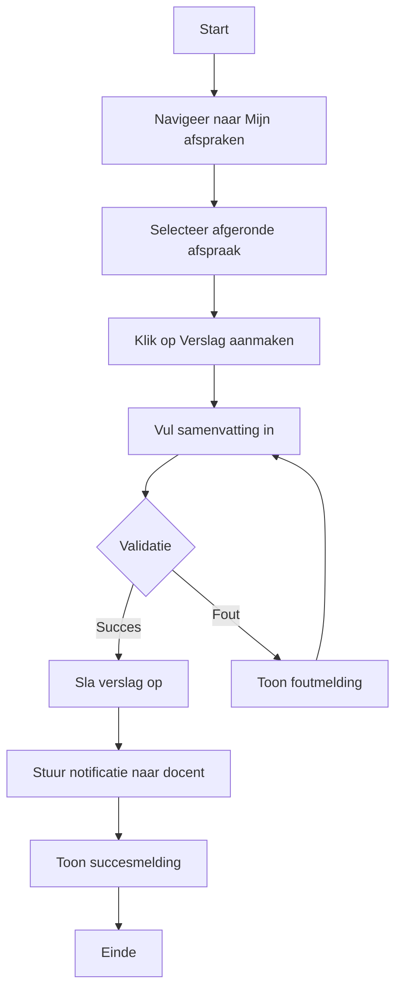

### Verslagen goed- of afkeuren
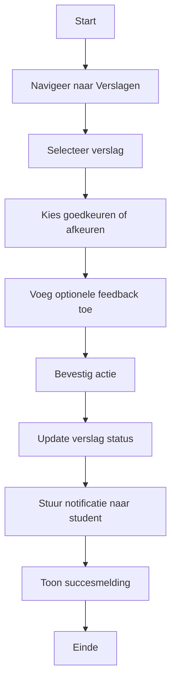

### Andere docenten uitnodigen
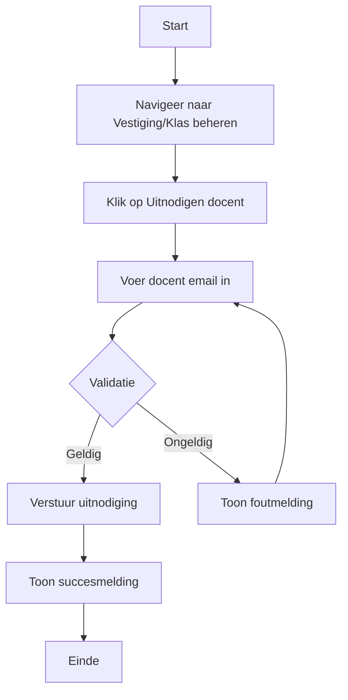

## Sequence diagrammen

### Inloggen Sequence
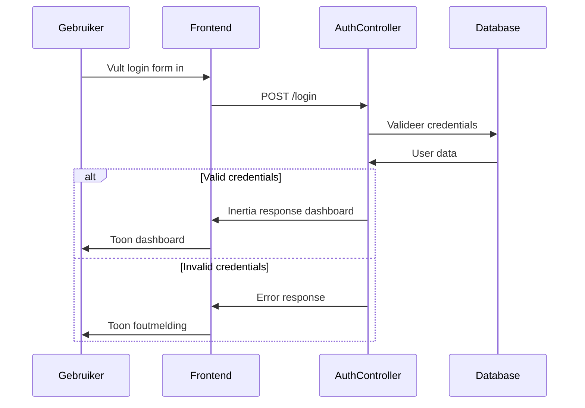

### Tijdblok Reserveren Sequence
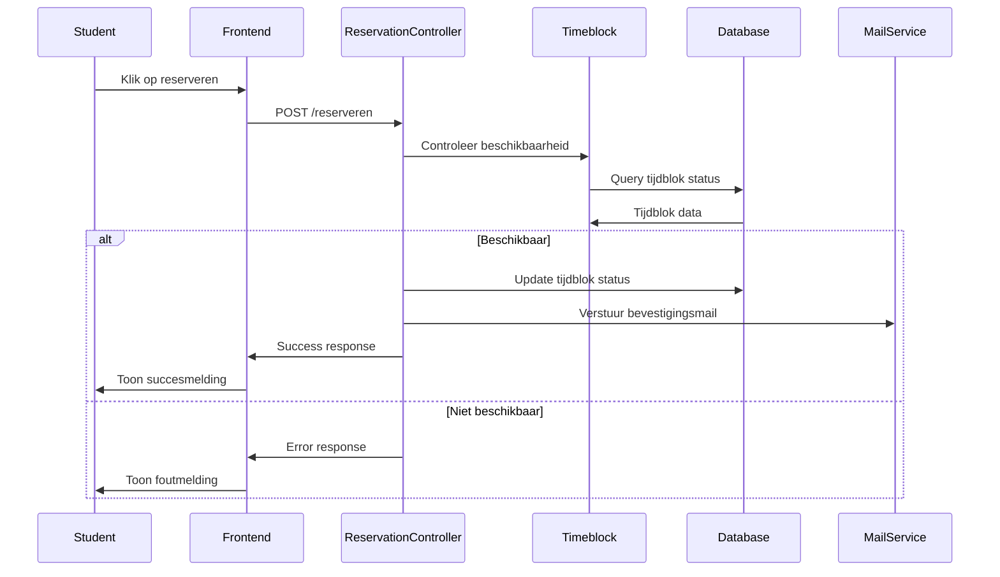

### Verslag Aanmaken Sequence
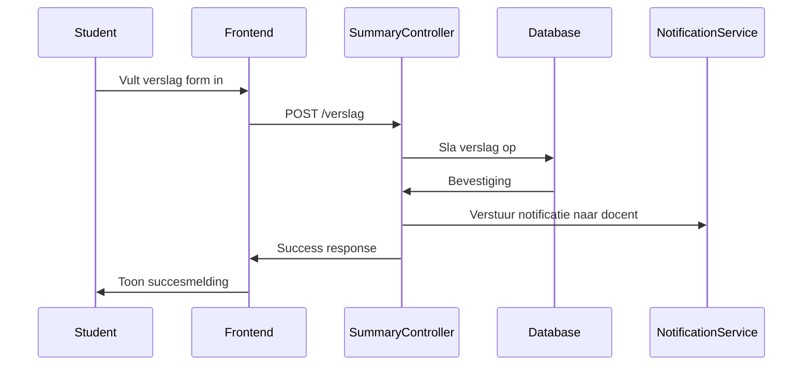

### Verslag Goedkeuren Sequence
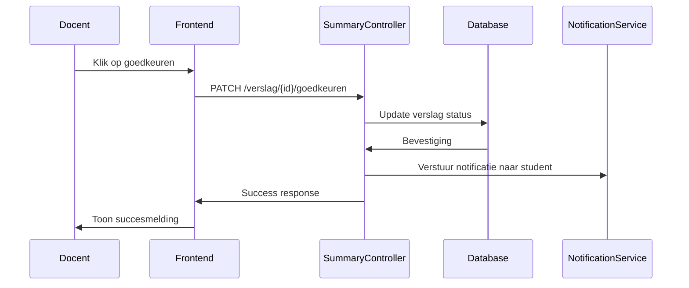

### Tijdblok Aanmaken Sequence
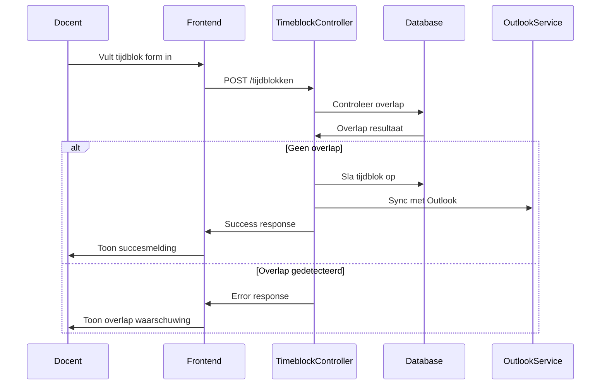

## Database-ontwerp

### ERD Diagram
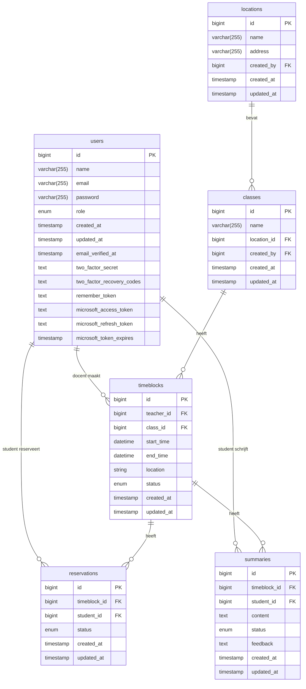

## Ontwikkeltools
- **IDE:** VS Code
- **Database Management:** DBeaver
- **API Testing:** Postman
- **Version Control:** Git + GitHub
- **Package Management:** Composer + NPM

## Beveiliging

### Autorisatie
**Technische implementatie:**
- Laravel Gates en Policies
- Role-based access control
- Middleware voor route protection
- Permission checks op controller niveau

### Gebruikers en rollen
**Rollen structuur:**
- **Student:** Kan tijdblokken reserveren, samenvattingen schrijven
- **Docent:** Kan tijdblokken aanmaken, samenvattingen beoordelen, klassen beheren

### Tijdblokken en reserveringen
**Beveiligingsmaatregelen:**
- Validatie van beschikbaarheid bij reservering
- Preventie van double-booking
- Autorisation checks bij wijzigingen

### Samenvattingen en privacy
**Privacy maatregelen:**
- Alleen betrokken student en docent hebben toegang
- Encryptie van gevoelige data

## Beheer

### Back-up
**Back-up strategie:**
- Dagelijkse database back-ups
- Wekelijkse full system back-ups

### Content
**Content management:**
- Database migrations voor schema wijzigingen
- Seeders voor test data
- Factories voor development